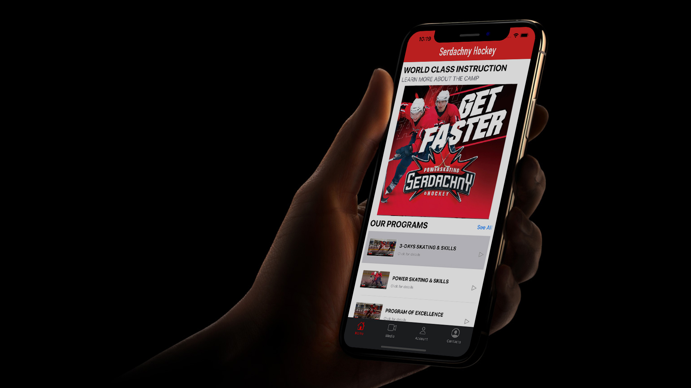

## Serdachny Hockey IOS Mobile App

## Introduction
ENSE 400/477 Capstone Project Fall 2019 - Winter 2020, University of Regina
- **Team Name**: Prime Software
- **About**: This project is in partnership with Serdachny Hockey under the direction of Steve Serdachny. Our team(Jiahao Li, Jinkai Fan, McKenzie Busenius) designed and developed a personalized mobile hockey learning management app with Serdachny Hockey School.
- [Demo Presentation Video](https://www.markdownguide.org/cheat-sheet/): In this video presentation, it has a product demo part and a presentation part. In the product demo part, we show how the general design and workflow looks like. In the presentation part, our team delivers a comprehensive demonstration of our team’s design problem/idea and design solution (features and functionality)/product deployment.

## Table of contents
- [Promotional picture](#serdachny-hockey-ios-mobile-app)
- [Introduction](#introduction)
- [Table of contents](#table-of-contents)
- [Demo screenshot](#demo-screenshot)
- [Requirements](#requirements)
- [Installation](#installation)
- [Usage](#usage)
- [Development](#development)
  - [Team meeting notes](#team-meeting-notes)
  - [Documentations](#documentations)
- [Scrum presentation timelines](#scrum-presentation-timelines)
- [Credits](#credits)
- [License](#license)

## Demo screenshot

## Requirements

## Installation

## Usage

## Development
### Team meeting notes
### Documentations

## Scrum presentation timelines

## Credits

## License
